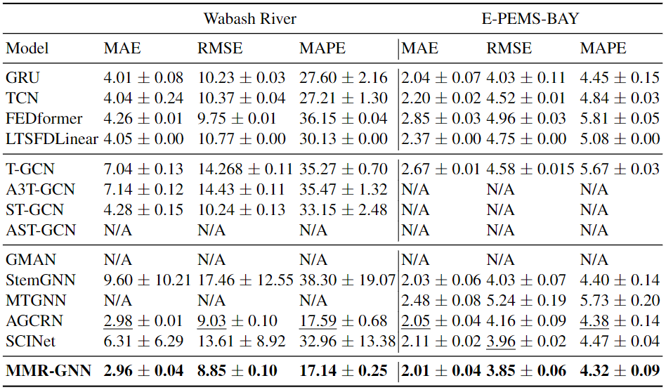

# MMR-GNN: Multi-Modal Recurrent Neural Networks for Spatiotemporal Forecasting (paper from PAKDD 2024)

Majeske, Nicholas, and Ariful Azad. "Multi-modal Recurrent Graph Neural Networks for Spatiotemporal Forecasting." Pacific-Asia Conference on Knowledge Discovery and Data Mining. Singapore: Springer Nature Singapore, 2024.


## Multi-Modal Recurrent Graph Neural Network

||
|:--:| 
| *Figure 1. Encoder-decoder architecture of MMR-GNN* |

||
|:--:| 
| *Figure 2. Graph Augmentation Layer (GraphAugr)* |

||
|:--:| 
| *Figure 3. Spatiotemporal Gated Recurrent Unit (stGRU)* |


## Primary Results



## Experiments

This repository contains only MMR-GNN implemented in PyTorch. For all experimental design/implementation including datasets, baseline models, and ablation studies, please refer to [[MMR-GNN Dev](https://github.com/HipGraph/MMR-GNN_Dev)] .


## Requirements

1. Python>=3.9
2. PyTorch 1.12.0


## Citation

```
@inproceedings{majeske2024multi,
  title={Multi-modal Recurrent Graph Neural Networks for Spatiotemporal Forecasting},
  author={Majeske, Nicholas and Azad, Ariful},
  booktitle={Pacific-Asia Conference on Knowledge Discovery and Data Mining},
  pages={144--157},
  year={2024},
  organization={Springer}
}
```


## Contact

nmajeske@iu.edu or azad@iu.edu
